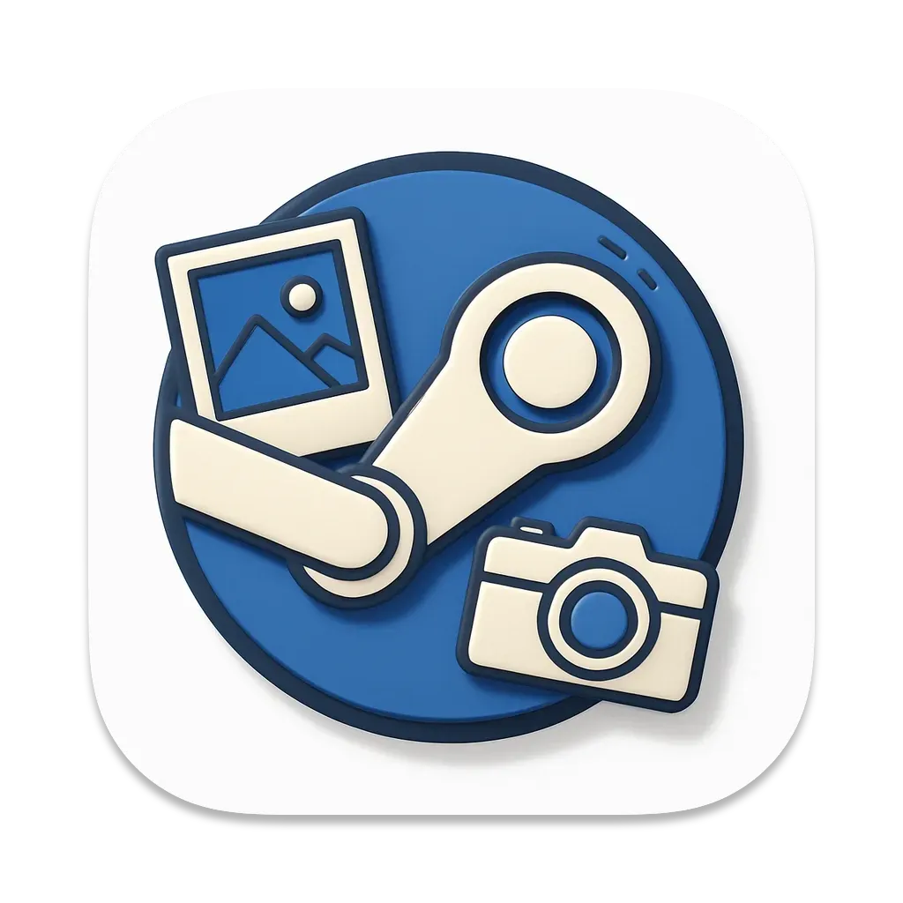

# SnapSteam




A tool for importing external images into Steam's screenshot library.

## Screenshots


## Videos

Windows: https://youtu.be/0yM4cpLRiSg

macOS: https://youtu.be/lASYlvCcAVY

## Installation

Download from the [Releases page](https://github.com/ihainan/SnapSteam/releases). Currently supports Windows and macOS (both Intel and Apple Silicon). Linux is not supported yet but you can build it from source.


## Features

- Import external images into Steam's screenshot library
- Organize and manage screenshots by game
- Support for multiple Steam accounts
- Search through your screenshot collection
- Dark/Light theme support

## Getting Started

1. Install dependencies:
```bash
npm install
```

2. Start the application:
```bash
npm run dev
```

## Building the Application

### Building for macOS
```bash
npm run package:mac # or npm run package:mac:intel for the Intel chip.
```

### Building for Windows
```bash
npm run package:win
```

The built application will be generated in the `dist` directory.

## License

ISC